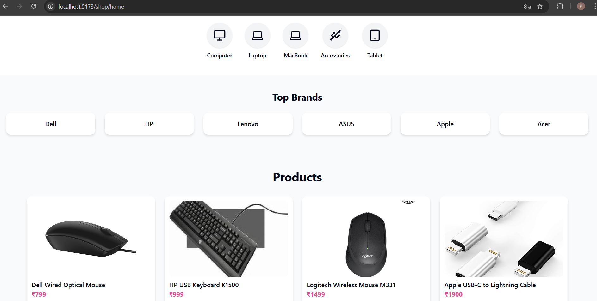
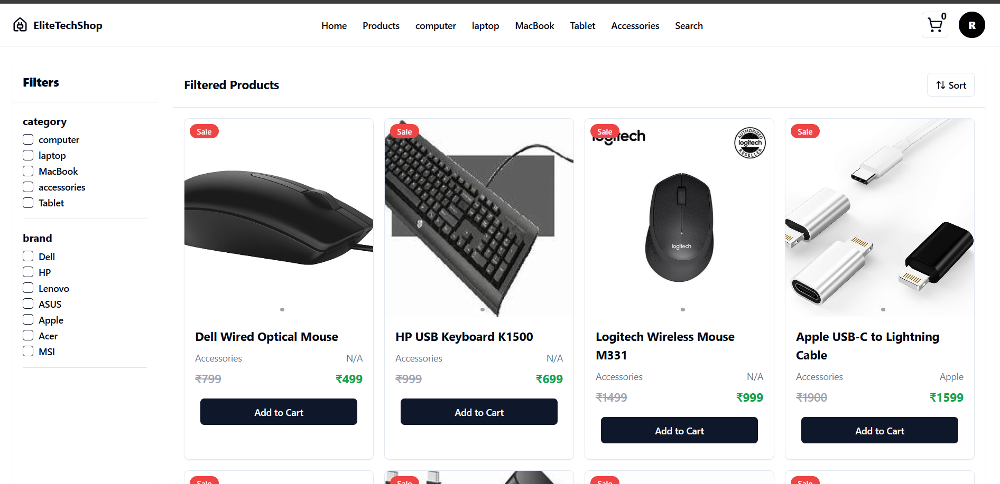
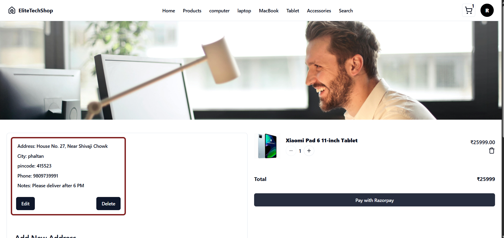
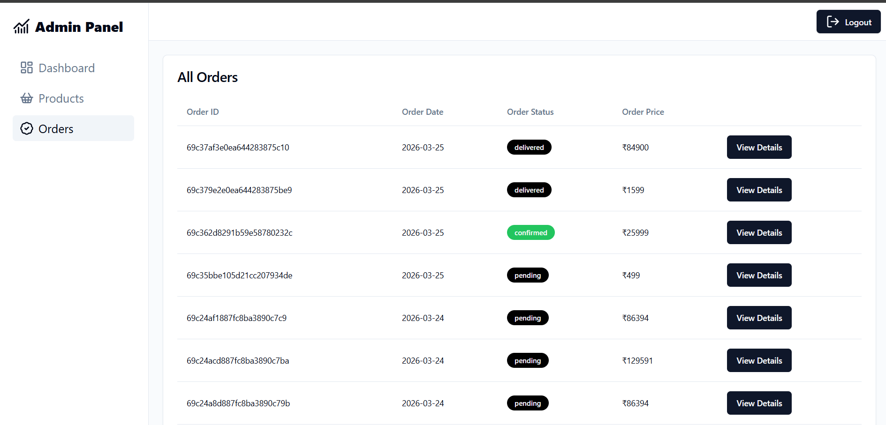

#  Online Computer Store (MERN Stack E-Commerce)

##  Project Overview

This is a full-stack **E-Commerce Web Application** for an **Online Computer Store**, built using the **MERN Stack**.

The platform allows users to browse computer products, add them to cart, and securely complete purchases. It also includes an **admin panel** for managing products and orders.

This project demonstrates real-world implementation of **authentication, payment integration, and scalable backend architecture**.

---


##  Key Features

###  User Features

* User Registration & Login (JWT Authentication)
* Browse Computer Products
* Add to Cart & Manage Cart
* Secure Checkout System
* filtering product  
* Online Payment Integration (Razorpay)

###  Admin Features

* Admin Dashboard
* Add / Update / Delete Products
* Manage Orders
* View User Activity

---

##  Tech Stack

### Frontend

* React.js
* HTML5
* CSS3
* JavaScript

### Backend

* Node.js
* Express.js

### Database

* MongoDB

### Other Technologies

* JWT Authentication
* RESTful APIs
* Razorpay Payment Gateway
* Git & GitHub

---


## ⚙️ Installation & Setup

### 1️⃣ Clone Repository

```bash
git clone https://github.com/pratik-takale/my-mern-project.git
```

### 2️⃣ Install Dependencies

Frontend:

```bash
cd client
npm install
```

Backend:

```bash
cd server
npm install
```

---

### 3️⃣ Run Application

Backend:

```bash
npm start
```

Frontend:

```bash
npm run dev 
```

---

## 🔐 Environment Variables

Create a `.env` file in the server folder:

```env
MONGO_URI=your_mongodb_connection_string
JWT_SECRET=your_secret_key
RAZORPAY_KEY_ID=your_key
RAZORPAY_SECRET=your_secret
```

---

## 💳 Payment Integration

* Integrated **Razorpay** for secure online payments
* Supports UPI, Cards, and Net Banking (Test Mode Supported)

---


##  Screenshots

###  Login & Register Page

###  Home Page


###  product Page


###  Checkout Page


###  Admin Panel


###  user Account page 


##  Author

**Pratik Takale**

* Data Scientist
* MERN Stack Developer


---

## ⭐ Future Enhancements

* Product Recommendation System (AI-based 🔥)
* Order Tracking System
* Email Notifications
* Reviews & Ratings System
* Advanced Admin Analytics Dashboard

---

